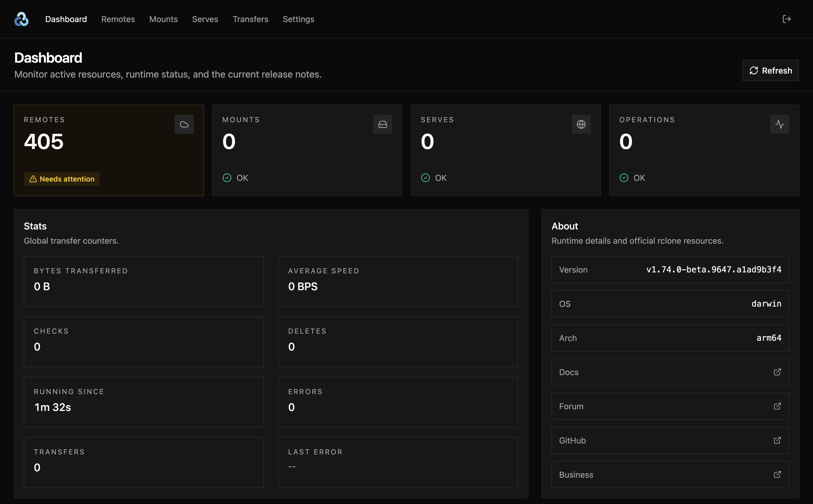

<p align="center"></p>

# Rclone Web
A lightweight web UI for [**rclone**](https://rclone.org/). Use it to manage remotes, mounts, serves, transfers, and common rclone actions from a browser.



## Usage
Install [rclone](https://rclone.org/install/) and run:

```bash
rclone gui
```

rclone opens the UI in your browser and prints generated credentials on startup. Pass `--user`, `--pass`, or `--addr` to override the defaults. See `rclone gui --help` for the full list of flags.

#### Screens
- **Dashboard** – overview of remotes, mounts, serves, running operations, and global transfer stats.
- **Remotes** – create, edit, and delete rclone remotes, with live usage per remote.
- **Mounts** – list active remote mounts, unmount them, or create new ones.
- **Serves** – list, start, and stop serve endpoints (HTTP, WebDAV, SFTP, …).
- **Transfers** – live and recent transfer jobs, with the option to stop running ones.
- **Settings** – tune performance flags, configure logging, and edit the rclone config file.

## Docker
The easiest way to run the UI is through the official rclone Docker image. After starting the container, open `http://localhost:5522/login?url=localhost:5533` in your browser. The `url` param tells the GUI where to reach the RC API.

#### Simple
```bash
docker run -d \
  --name rclone-gui \
  -p 5522:5522 \
  -p 5533:5533 \
  -v ~/.config/rclone:/config/rclone \   # if you want to use a local config you already have
  -v /path/to/data:/data \               # if you want to mount other folders, eg for cache
  rclone/rclone:latest \
  gui \
  --addr=0.0.0.0:5522 \
  --api-addr=0.0.0.0:5533 \
  --user gui-user \						# skip to auto-generate a user
  --pass 'change-this-password' 		# skip to auto-generate a pass
```

#### Compose
```yaml
services:
  rclone-gui:
    image: rclone/rclone:latest
    container_name: rclone-gui
    restart: unless-stopped
    ports:
      - "5522:5522"
      - "5533:5533"
    volumes:
      - ~/.config/rclone:/config/rclone
      - /path/to/data:/data
    command:
      - gui
      - --addr=0.0.0.0:5522
      - --api-addr=0.0.0.0:5533
      - --user=gui-user
      - --pass=change-this-password
```

Mount `~/.config/rclone` if you want to reuse an existing local config. Mount any additional folders, such as `/path/to/data`, when rclone needs access to local files or cache locations.

You can omit `--user` and `--pass` to let rclone generate credentials.

## Development
```bash
npm install
npm run dev
```

Useful scripts:

- `npm run build` builds the web app.
- `npm run lint` checks formatting and lint rules with Biome.
- `npm test` builds the app and runs the Playwright test suite against `rclone gui`.

## Contributing
We welcome new contributors!

Areas where help is especially useful:
- Bug fixes
- Accessibility improvements
- Tests
- Translations ([**Web**](https://github.com/rclone/rclone-web/tree/main/src/languages) or [**RC**](https://github.com/rclone-ui/rclone-i18n))

## License
MIT